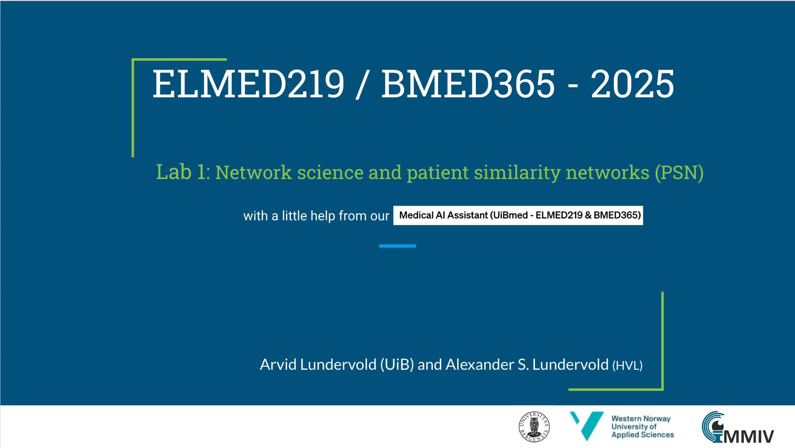

# Lab 1: Nettverksvitenskap og pasient-likhetsnettverk (PSN)

Denne labben gir en praktisk, eksempelbasert introduksjon til **grafteori**, **nettverksvitenskap** og konseptet **pasient-likhetsnettverk** (Patient Similarity Networks, PSN). Vi bruker *NetworkX* – et Python-bibliotek for å opprette, manipulere og analysere komplekse nettverk.

---

## 🎯 Læringsmål

Etter å ha gjennomført denne labben skal du kunne:

| Tema | Læringsmål |
|------|-----------|
| **Grafteori** | Forstå hva en graf er (noder, kanter) og skille mellom urettede/rettede og vektede/uvektede grafer |
| **Nabomatriser** | Representere grafer som matriser og forstå sammenhengen mellom graf og matrise |
| **Nettverksvitenskap** | Beregne og tolke sentrale nettverksmetrikker (sentralitet, klyngekoeffisient, tetthet) |
| **NetworkX** | Bygge, manipulere og visualisere nettverk i Python med NetworkX |
| **Likhetsberegning** | Beregne likhet mellom datapunkter ved hjelp av avstandsmål (Euklidsk, Manhattan, Gower) |
| **Pasient-likhetsnettverk** | Konstruere PSN fra kliniske data og tolke nettverksstrukturen medisinsk |
| **Community detection** | Anvende algoritmer (Louvain) for å identifisere naturlige grupperinger i nettverk |
| **Klinisk anvendelse** | Forstå hvordan PSN kan brukes til å oppdage pasientsubgrupper og støtte presisjonsmedisin |

---

## 🤖 AI-assistert læring

 

Hvis du har tilgang til [ChatGPT Plus](https://openai.com/blog/chatgpt-plus), kan du prøve [**Medical AI Assistant (UiBmed - ELMED219 & BMED365)**](https://chat.openai.com/g/g-d90dfN17H-medical-ai-assistant-uibmed-elmed219-bmed365) for å få hjelp med spørsmål knyttet til grafteori, nettverksvitenskap og pasient-likhetsnettverk (se også [dette dokumentet](./assets/ELMED219_BMED365_2024_PSN.pdf)).

Eksempler på spørsmål du kan stille:
- _Hva er grafteori og hvordan defineres en graf?_
- _Hva menes med "nettverksvitenskap"?_
- _Hva karakteriserer et "pasient-likhetsnettverk" og hva kan det brukes til?_
- _Forklar forskjellen mellom sentralitetsmål som degree, betweenness og eigenvector centrality_

(Sammenlign gjerne svarene med responser fra UiB-interne **https://chat.uib.no**)

---

## 📊 Slides

---

## 📓 Notebooks

Alle notebooks er skrevet på norsk og kan kjøres i Google Colab eller lokalt med conda-miljøet `elmed219-2026`.

### Hovednotebooks

| Notebook | Beskrivelse | Colab |
|:---------|:------------|:-----:|
| [00-introduksjon.ipynb](./notebooks/00-introduksjon.ipynb) | **Introduksjon til grafteori, nettverksvitenskap og PSN** – Grunnleggende konsepter, graftyper, nabomatriser, sentralitetsmål og interaktiv læringsmodul |  |
| [01-networkx_tutorial.ipynb](./notebooks/01-networkx_tutorial.ipynb) | **NetworkX tutorial** – Praktisk innføring i NetworkX: opprette grafer, manipulere noder/kanter, bruke attributter, analysere strukturer og visualisere nettverk |  |
| [02-pasient_likhetsnettverk_iris.ipynb](./notebooks/02-pasient_likhetsnettverk_iris.ipynb) | **PSN med IRIS-data** – Bygg ditt første likhetsnettverk med det klassiske IRIS-datasettet. Dekker likhetsberegning, visualisering, nettverksanalyse og community detection |  |
| [03-pasient_likhetsnettverk_ibs_hjerne_kognisjon.ipynb](./notebooks/03-pasient_likhetsnettverk_ibs_hjerne_kognisjon.ipynb) | **PSN med kliniske data (IBS)** – Anvendelse av PSN på ekte pasientdata: hjerne-morfometri og kognisjon ved irritabel tarmsyndrom, basert på [Lundervold et al. (2025)](https://doi.org/10.3390/diagnostics15040470) |  |
| [04-pasient_likhetsnettverk_IQ.ipynb](./notebooks/04-pasient_likhetsnettverk_IQ.ipynb) | **PSN basert på IQ-testing (WAIS-IV)** – Konstruer likhetsnettverk fra intelligenstestdata for å identifisere kognitive profiler og undergrupper |  |

### Løsningsnotebooks

| Notebook | Beskrivelse | Colab |
|:---------|:------------|:-----:|
| [02a-pasient_likhetsnettverk_iris_losninger.ipynb](./notebooks/02a-pasient_likhetsnettverk_iris_losninger.ipynb) | Løsninger til øvelsene i notebook 02 |  |
| [02b-pasient_likhetsnettverk_iris_utvidet.ipynb](./notebooks/02b-pasient_likhetsnettverk_iris_utvidet.ipynb) | Utvidet versjon av IRIS PSN-analysen med flere avanserte teknikker |  |
| [04-pasient_likhetsnettverk_IQ_losninger.ipynb](./notebooks/04-pasient_likhetsnettverk_IQ_losninger.ipynb) | Løsninger til øvelsene i notebook 04 |  |

---

## 📚 Tilleggsressurser: Grafteori og komplekse nettverk

Se også [GraphTheory-and-ComplexNetworks](./GraphTheory-and-ComplexNetworks/README.md)-mappen for mer dyptgående notebooks om grafteori:

| Notebook | Tema | Colab |
|:---------|:-----|:-----:|
| [1-Introduction.ipynb](./GraphTheory-and-ComplexNetworks/notebooks/1-Introduction.ipynb) | Introduksjon til grafer og nettverk |  |
| [2-Fundamentals.ipynb](./GraphTheory-and-ComplexNetworks/notebooks/2-Fundamentals.ipynb) | Grunnleggende grafteori |  |
| [3-Extensions.ipynb](./GraphTheory-and-ComplexNetworks/notebooks/3-Extensions.ipynb) | Utvidelser og spesielle graftyper |  |
| [4-Network-topology.ipynb](./GraphTheory-and-ComplexNetworks/notebooks/4-Network-topology.ipynb) | Nettverkstopologi |  |
| [5-Network-analysis-centrality.ipynb](./GraphTheory-and-ComplexNetworks/notebooks/5-Network-analysis-centrality.ipynb) | Sentralitetsanalyse |  |
| [6-Network-analysis-across-time.ipynb](./GraphTheory-and-ComplexNetworks/notebooks/6-Network-analysis-across-time.ipynb) | Dynamisk nettverksanalyse |  |

---

## 📖 Andre ressurser

### Grafteori og nettverksvitenskap
- A. Lundervold & Medical AI Assistant: _Elements of graph theory and patient similarity networks (PSN) - A short introduction for ELMED219+BMED365_ [[PDF](./assets/ELMED219_BMED365_2024_PSN.pdf)] [[$\LaTeX$](https://www.overleaf.com/read/pccnktqbnswg#4f47e2)]

- **Khan Academy Graph Theory:** En nybegynnervennlig serie om grunnleggende konsepter og anvendelser. [Khan Academy Graph Theory](https://www.khanacademy.org/computing/computer-science/algorithms/graph-representation/a/describing-graphs)
    
- **Graph Theory Tutorials av Sarada Herke:** En YouTube-spilleliste med visuelle og intuitive forklaringer av grafteorikonsepter. [Sarada Herkes grafteori-tutorials](https://www.youtube.com/playlist?list=PLoJC20gNfC2gmT_5WgwYwGMvgCjYVsIQg)
    
- **Introduksjon til grafteori for medisinstudenter:** [Notater](https://docs.google.com/document/d/1Hy68-fjs1EJV3LL03qYusYydyXP7IAwsUnIYlaC9MdE/edit?usp=sharing) generert av Gemini Advanced 1.5 Pro med [Deep Research](https://blog.google/products/gemini/google-gemini-deep-research)

- **Barabási, A.-L.** (2016). *Network Science*. Cambridge University Press. [Gratis online](http://networksciencebook.com/)

### Jupyter Notebook
Hvis Jupyter Notebook er nytt for deg, kan disse tutorialene være nyttige:
* https://jupyter-notebook-beginner-guide.readthedocs.io/en/latest/index.html
* https://www.datacamp.com/community/tutorials/tutorial-jupyter-notebook

---

## 💡 Din tur!

Bruk tid på å eksperimentere med eksemplene i notebookene. Du finner spørsmål og øvelser underveis som du kan utforske. Hvis du allerede er kjent med grafer og nettverk, kan du prøve deg på mer avanserte eksempler – eller enda bedre, hjelp andre i gruppen som har mindre erfaring.

### Anbefalt rekkefølge:

1. **Start med `00-introduksjon.ipynb`** for å få oversikt over grafteori og PSN-konseptet
2. **Gå gjennom `01-networkx_tutorial.ipynb`** for å lære NetworkX-verktøyet
3. **Bygg ditt første PSN med `02-pasient_likhetsnettverk_iris.ipynb`**
4. **Anvend kunnskapen på kliniske data** med notebook 03 eller 04

Lykke til! 🚀
