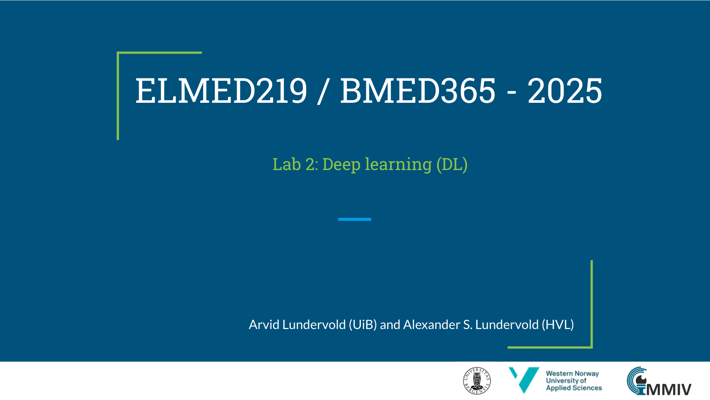

# Lab 2: Dyp læring (DL)

I denne labben utforsker vi konsepter og anvendelser av **dyp læring** (deep learning) i medisin og biomedisinsk forskning. Materialet er inspirert av og lenker til arbeidet til fremragende undervisere og forskere som [Grant Sanderson](https://www.3blue1brown.com/about), [Daniel Bourke](https://www.mrdbourke.com/about) og [Andrej Karpathy](https://karpathy.ai).

---

## Læringsmål

Etter å ha gjennomført denne labben skal du kunne:

| Tema | Læringsmål |
|------|-----------|
| **Nevrale nettverk** | Forklare hva et nevralt nettverk er og hvordan det lærer fra data |
| **Dyp læring** | Skille mellom tradisjonell maskinlæring og dyp læring, og forstå når dyp læring er fordelaktig |
| **MLP** | Forstå arkitekturen til et multilags perseptron (MLP) og hvordan det brukes til klassifisering |
| **CNN** | Forklare hvordan konvolusjonelle nevrale nettverk (CNN) fungerer og hvorfor de er effektive for bildeanalyse |
| **PyTorch** | Bruke PyTorch til å bygge og trene enkle nevrale nettverk |
| **Trening** | Forstå treningsprosessen: forward pass, loss-funksjon, backpropagation og optimalisering |
| **MNIST** | Gjennomføre en komplett klassifiseringsoppgave på MNIST-datasettet |
| **Medisinsk kontekst** | Forstå hvordan dyp læring anvendes i medisinsk bildeanalyse |

---

## Prioriteringsguide for studenter

Notebooks er organisert etter prioritet. **Start med kjerne-notebooks** og gå videre etter tid og interesse:

| Prioritet | Notebook | Beskrivelse | Estimert tid |
|:---------:|:---------|:------------|:------------:|
| **1 (kjerne)** | [00a-CNN-basics](notebooks/00a-CNN-basics.ipynb) | Konseptuell introduksjon til CNN med medisinske analogier | 30 min |
| **1 (kjerne)** | [03-MNIST-MLP](notebooks/03-MNIST-Classification-with-MLP.ipynb) | Praktisk dyp læring: klassifisering med MLP | 45 min |
| **2 (anbefalt)** | [04-MNIST-CNN](notebooks/04-MNIST-Classification-with-CNN.ipynb) | CNN i praksis på MNIST | 45 min |
| **2 (anbefalt)** | [00b-Pytorch-Lightning](notebooks/00b-Pytorch-Lightning-basics.ipynb) | Grunnleggende PyTorch og Lightning | 45 min |
| **3 (valgfri)** | [01-MNIST-collect](notebooks/01-MNIST-collect-organize.ipynb) | Datainnsamling og -organisering | 30 min |
| **3 (valgfri)** | [02-MNIST-RF](notebooks/02-MNIST-Classification-with-Random-Forest.ipynb) | ML baseline med Random Forest | 30 min |
| **4 (avansert)** | [06-TabPFN-explore](notebooks/06-TabPFN-explore.ipynb) | Dyp læring på tabelldata | 60 min |
| **4 (avansert)** | [07-TabPFN-neuro](notebooks/07-TabPFN-neuro.ipynb) | TabPFN anvendt i nevrovitenskap | 60 min |

---

## Ressurser

### Lysbilder

<a href="https://docs.google.com/presentation/d/e/2PACX-1vRUu4XSPSOL6nHyeIpbJATMKvu4lWcjosw5sWUG3iDlNWbHTK-6MRj3VfxepE9Vw2CDM25dikA8XFuU/pub?start=false&loop=false&delayms=3000"></a>

### Notebooks

| Notebook | Beskrivelse | Colab |
|:---------|:------------|:------|
| [00a-CNN-basics.ipynb](notebooks/00a-CNN-basics.ipynb) | Kort introduksjon til **CNN** for medisinstudenter – AI-assistert notebook | [](https://colab.research.google.com/github/arvidl/ELMED219-2026/blob/main/Lab2-DL/notebooks/00a-CNN-basics.ipynb) |
| [00b-Pytorch-Lightning-basics.ipynb](notebooks/00b-Pytorch-Lightning-basics.ipynb) | Kort introduksjon til **PyTorch** og **Lightning** for medisinstudenter | [](https://colab.research.google.com/github/arvidl/ELMED219-2026/blob/main/Lab2-DL/notebooks/00b-Pytorch-Lightning-basics.ipynb) |
| [01-MNIST-collect-organize.ipynb](notebooks/01-MNIST-collect-organize.ipynb) | MNIST datainnsamling, inspeksjon og organisering | [](https://colab.research.google.com/github/arvidl/ELMED219-2026/blob/main/Lab2-DL/notebooks/01-MNIST-collect-organize.ipynb) |
| [02-MNIST-Classification-with-Random-Forest.ipynb](notebooks/02-MNIST-Classification-with-Random-Forest.ipynb) | MNIST-klassifisering med Random Forest (baseline) | [](https://colab.research.google.com/github/arvidl/ELMED219-2026/blob/main/Lab2-DL/notebooks/02-MNIST-Classification-with-Random-Forest.ipynb) |
| [03-MNIST-Classification-with-MLP.ipynb](notebooks/03-MNIST-Classification-with-MLP.ipynb) | MNIST-klassifisering med multilags perseptron (MLP) | [](https://colab.research.google.com/github/arvidl/ELMED219-2026/blob/main/Lab2-DL/notebooks/03-MNIST-Classification-with-MLP.ipynb) |
| [04-MNIST-Classification-with-CNN.ipynb](notebooks/04-MNIST-Classification-with-CNN.ipynb) | MNIST-klassifisering med konvolusjonelt nevralt nettverk (CNN) | [](https://colab.research.google.com/github/arvidl/ELMED219-2026/blob/main/Lab2-DL/notebooks/04-MNIST-Classification-with-CNN.ipynb) |
| [06-TabPFN-explore.ipynb](notebooks/06-TabPFN-explore.ipynb) | Utforskning av dyp læring på tabelldata med TabPFN | [](https://colab.research.google.com/github/arvidl/ELMED219-2026/blob/main/Lab2-DL/notebooks/06-TabPFN-explore.ipynb) |
| [07-TabPFN-neuro.ipynb](notebooks/07-TabPFN-neuro.ipynb) | TabPFN anvendt i nevrovitenskap | [](https://colab.research.google.com/github/arvidl/ELMED219-2026/blob/main/Lab2-DL/notebooks/07-TabPFN-neuro.ipynb) |

### Eksternt materiale: Hjernesvulst-segmentering

| Notebook | Beskrivelse | Colab |
|:---------|:------------|:------|
| [05-BrainTumor-Segmentation](https://nbviewer.org/github/MMIV-ML/fastMONAI/blob/master/nbs/10d_tutorial_multiclass_segmentation.ipynb) | Hjernesvulst-segmentering fra multiparametrisk MRI (fastMONAI) | [](https://colab.research.google.com/github/MMIV-ML/fastMONAI/blob/master/nbs/10d_tutorial_multiclass_segmentation.ipynb) |

---

## Kom i gang

### Google Colab (anbefalt)

Alle notebooks kan kjøres direkte i Google Colab uten lokal installasjon:

1. Klikk på Colab-badgen ved notebooken du vil kjøre
2. Logg inn med Google-konto
3. Kjør cellene med `Shift+Enter`

**Merk:** MNIST-datasettet (~12 MB) lastes ned automatisk ved første kjøring.

### Lokal kjøring

For lokal kjøring, bruk conda-miljøet fra rotkatalogen:

```bash
conda env create -f environment.yml
conda activate elmed219
jupyter notebook
```

---

## Læringsmotivasjon – se disse videoene

Sortert etter varighet (korteste først):

| Video | Forfatter | Varighet |
|:------|:----------|:--------:|
| [What is Deep Learning?](https://youtu.be/6M5VXKLf4D4) | Simplilearn | 6 min |
| [What is backpropagation really doing?](https://youtu.be/Ilg3gGewQ5U) | 3Blue1Brown | 13 min |
| [But what is a neural network?](https://youtu.be/aircAruvnKk) | 3Blue1Brown | 19 min |
| [Gradient descent, how neural networks learn](https://youtu.be/IHZwWFHWa-w) | 3Blue1Brown | 21 min |
| [But what is a convolution?](https://youtu.be/KuXjwB4LzSA) | 3Blue1Brown | 23 min |
| [Building a neural network FROM SCRATCH](https://youtu.be/w8yWXqWQYmU) | Samson Zhang | 31 min |
| [Deep Learning State of the Art (2019)](https://youtu.be/53YvP6gdD7U) | Lex Fridman (MIT) | 46 min |
| [MIT 6.S191: Intro to Deep Learning](https://youtu.be/QDX-1M5Nj7s) | Alexander Amini | 58 min |
| [Building micrograd](https://youtu.be/VMj-3S1tku0) | Andrej Karpathy | 2.5 t |
| [Deep Learning Crash Course](https://youtu.be/CzBLfz89_60) | Simplilearn | 5.5 t |
| [Learn PyTorch in a day](https://youtu.be/Z_ikDlimN6A) | Daniel Bourke | 25 t |

### Anbefalte kurs (for videre fordypning)

- [MIT 6.S191: Introduction to Deep Learning](http://introtodeeplearning.com) – Komplett kurs med slides og lab-materiale
- [Stanford CS231n: CNNs for Visual Recognition](http://vision.stanford.edu/teaching/cs231n) – Klassisk kurs om CNN og bildegjenkjenning
- [Learn PyTorch](https://learnpytorch.io) – Omfattende PyTorch-tutorial av Daniel Bourke

---

## AI-assistent


Har du tilgang til ChatGPT Plus? Prøv [**Medical AI Assistant (UiBmed)**](https://chat.openai.com/g/g-d90dfN17H-medical-ai-assistant-uibmed-elmed219-bmed365) – en spesialtilpasset GPT for ELMED219 og BMED365.
