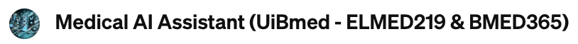
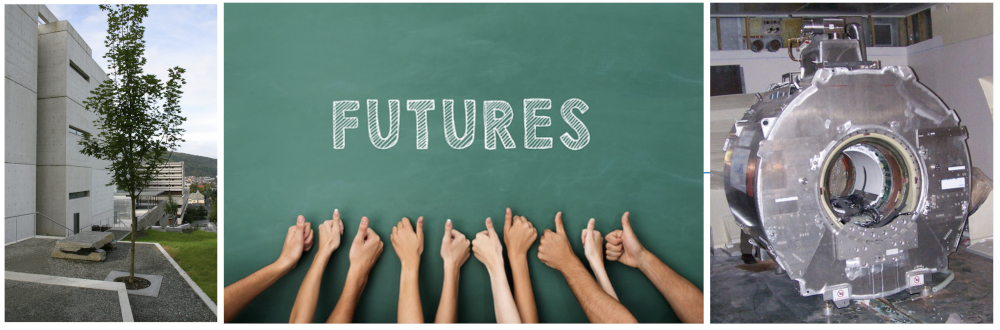

# ELMED219: Kunstig intelligens og beregningsorientert medisin (2026)

_MERK: Innholdet for våren 2026 er under løpende revisjon og oppdatering frem til kursstart ..._

 <br>
Hvis du har et abonnement på [ChatGPT Plus](https://openai.com/blog/chatgpt-plus), kan du også prøve [**Medical AI Assistant (UiBmed - ELMED219 & BMED365)**](https://chat.openai.com/g/g-d90dfN17H-medical-ai-assistant-uibmed-elmed219-bmed365) og se om du kan få svar på noen av spørsmålene dine.

Se også:
- **[NotebookLM](https://notebooklm.google.com/)** - AI-drevet forskningsassistent for dokumentanalyse og kunnskapssammenstilling
- **[Cursor AI](https://cursor.sh/)** - AI-assistert koding og utvikling

----
<!--
<p>

[](https://deepnote.com/launch?url=https%3A%2F%2Fgithub.com%2Fmmiv-ml%2FELMED219) &nbsp; [](https://www.kaggle.com/alexanderlundervold/code) &nbsp;  [](https://colab.research.google.com/github/MMIV-ML/ELMED219/blob/main/) &nbsp; [](https://mybinder.org/v2/gh/MMIV-ML/ELMED219/HEAD) &nbsp; [](https://nbviewer.org/github/MMIV-ML/ELMED219/tree/main/)
</p>
-->
 <br>

#### Kursoversikt
[ELMED219](https://www.uib.no/en/course/ELMED219) undersøker hvordan kunstig intelligens og beregningsverktøy former moderne helsetjenester. Kurset tilbys i samarbeid med [Institutt for biomedisin](https://www.uib.no/en/biomedisin) ved Universitetet i Bergen (UiB) og Medical AI-gruppen ved [Mohn Medical Imaging and Visualization Center](https://mmiv.no) (MMIV).


#### Hva du vil lære
Dette kurset gir praktisk kunnskap i **beregningsorientert** (computational) tenkning, medisinsk bildebehandling, og bruk av maskinlæring og generativ AI i helsetjenesten. Du vil lære å anvende disse ferdighetene i kontekst av presisjonsmedisin og persontilpasset medisin, med fokus på generativ AI, grafteori og pasient-likhetsnettverk (PSN) kvantitativ avbildning og biomarkører. Kurset tar også opp **etiske** og **regulatoriske** utfordringer, inkludert datahåndtering og EU AI Act, og gir studentene et balansert perspektiv på **forklarba**r AI (XAI), **pålitelig** (trustworthy) AI og **innovasjon** innen medisinsk AI. Temaer som **nevrosymbolsk** AI og **agentisk** AI vil også bli omtalt.

En mer detaljert emnebeskerivelse med **momenliste** finner du [her](https://github.com/arvidl/ELMED219-2026/blob/main/Emnebeskrivelse-momentliste/emnebeskrivelse-og-momentliste.pdf), og videre spesifisert ved:  [A-Etikk](https://github.com/arvidl/ELMED219-2026/blob/main/Emnebeskrivelse-momentliste/Beamer/A-Etikk/main.pdf), [B-Bildeanalyse](https://github.com/arvidl/ELMED219-2026/blob/main/Emnebeskrivelse-momentliste/Beamer/B-Bildeanalyse/main.pdf), [D-Dyplæring](https://github.com/arvidl/ELMED219-2026/blob/main/Emnebeskrivelse-momentliste/Beamer/D-Dyplaering/main.pdf), [E-Evaluering](https://github.com/arvidl/ELMED219-2026/blob/main/Emnebeskrivelse-momentliste/Beamer/E-Evaluering/main.pdf), [F-Ferdigheter](https://github.com/arvidl/ELMED219-2026/blob/main/Emnebeskrivelse-momentliste/Beamer/F-Ferdigheter/main.pdf), [G-GenerativAI](https://github.com/arvidl/ELMED219-2026/blob/main/Emnebeskrivelse-momentliste/Beamer/G-GenerativAI/main.pdf), [M-Maskinlæring](https://github.com/arvidl/ELMED219-2026/blob/main/Emnebeskrivelse-momentliste/Beamer/M-Maskinlaering/main.pdf), [N-Grafteori](https://github.com/arvidl/ELMED219-2026/blob/main/Emnebeskrivelse-momentliste/Beamer/N-Grafteori/main.pdf), [P-PSN](https://github.com/arvidl/ELMED219-2026/blob/main/Emnebeskrivelse-momentliste/Beamer/P-PSN/main.pdf), [S-Nevrosymbolsk](https://github.com/arvidl/ELMED219-2026/blob/main/Emnebeskrivelse-momentliste/Beamer/S-Nevrosymbolsk/main.pdf), [T-Trustworthy](https://github.com/arvidl/ELMED219-2026/blob/main/Emnebeskrivelse-momentliste/Beamer/T-Trustworthy/main.pdf) og  [X-XAI](https://github.com/arvidl/ELMED219-2026/blob/main/Emnebeskrivelse-momentliste/Beamer/X-XAI/main.pdf).

#### Praktiske anvendelser
Gjennom øvelser og demonstrasjoner vil deltakerne arbeide med praktiske anvendelser, inkludert analyse av MR-data, segmentering av medisinske bilder, bygging av modeller for biomarkørprediksjon, og utforsking av konsepter som [Patient similarity networks](https://pmc.ncbi.nlm.nih.gov/articles/PMC11321866) og [multimodal dataanalyse](https://www.nature.com/articles/s41591-022-01981-2). Kurset introduserer også store språkmodeller ([grunnmodeller](https://en.wikipedia.org/wiki/Foundation_model)) og deres potensielle bruk i helsetjenesten.

#### [Ferdigheter og verktøy](https://github.com/arvidl/ELMED219-2026/blob/main/Emnebeskrivelse-momentliste/Beamer/F-Ferdigheter/main.pdf)
Studentene vil få erfaring med Python-programmering, [Jupyter notebooks](https://docs.jupyter.org), moderne AI-verktøy som [ChatGPT](https://chatgpt.com), [Gemini](https://gemini.google.com), og [Claude](https://claude.ai), **prompt-** og [context engineering](https://www.promptingguide.ai/guides/context-engineering-guide), samt skybasert databehandling og [AI-assistert koding](https://github.com/resources/articles/ai/ai-coding-tools). Det legges vekt på åpen vitenskap og reproduserbar forskningspraksis for å forberede studentene på både akademiske og praktiske situasjoner.

#### Teamprosjekt
Kurset inkluderer et [teamprosjekt](./Team-prosjekt) med tittelen *«Presisjonsmedisin og kvantitativ avbildning ved glioblastom»*. Studentene samarbeider i tverrfaglige team for å utarbeide en forskningsplan (søknadsskisse) som kombinerer bildeteknologi, biomarkører og maskinlæring. Prosjektet er felles med BMED365 og rapporten skrives på engelsk.

#### Hvorfor ta dette kurset?
ELMED219 er en mulighet til å tilegne seg verdifulle ferdigheter og innsikt i bruk av AI innen medisin og helsetjenester.

<!--The objective and content of the course address: The computational mindset, imaging, modeling, machine learning, and AI in future medicine, as well as ethical and regulatory aspects of AI. The course is a guided "journey" with a hands-on component through selected computational modeling techniques within biomedical and clinical applications. Examples, demonstrations, and tasks will be related to in vivo imaging (MRI) and segmentation, biomarkers and prediction, [network analysis](https://pmc.ncbi.nlm.nih.gov/articles/PMC11321866) ("patient similarity networks"), [multimodal data](https://www.nature.com/articles/s41591-022-01981-2), as well as large language models ("[foundation models](https://en.wikipedia.org/wiki/Foundation_model)") within medicine and health. Throughout the course, students will use principles and modern tools for data analysis, machine learning, and generative AI (e.g. [ChatGPT](https://chatgpt.com), [Gemini](https://gemini.google.com), [Claude](https://claude.ai)) within medical applications. The course will give the students an introduction to Python and [Jupyter notebooks](https://docs.jupyter.org), use of [AI-assisted coding](https://github.com/resources/articles/ai/ai-coding-tools), and the "cloud" for access to open data, calculations, and knowledge, as well as insight into and rationale for "open science" and "reproducible research". All course material is openly available on this GitHub repository. (See also [BMED365](https://github.com/MMIV-ML/BMED365))
-->

#### Åpent tilgjengelig materiale
Alt kursmateriale er åpent tilgjengelig i dette GitHub-repositoriet. Se også [BMED365](https://github.com/arvidl/BMED365-2026).

#### For påmeldte studenter
**Merk**: Studenter som er påmeldt kurset finner ytterligere praktisk informasjon på [MittUiB](https://mitt.uib.no/courses/50716).


<!-- - On your own, you are encouraged to spend approximately four hours completing at least one DataCamp course (remember to use the link on MittUiB for free access to DataCamp). Which DataCamp course you're encouraged to do depends on your previous programming experience:<br>
  - No Python programming experience? Complete the course [Introduction to Python](https://learn.datacamp.com/courses/intro-to-python-for-data-science)<br>
  - Know some Python, but no machine learning? Complete the course [Supervised Learning with scikit-learn](https://learn.datacamp.com/courses/supervised-learning-with-scikit-learn)<br>
  - Know the fundamentals of machine learning in Python? Can you pass the *Machine Learning Fundamentals Assessment*? Complete the course [Biomedical Image Analysis in Python](https://learn.datacamp.com/courses/biomedical-image-analysis-in-python)   
-->
-  For **akademiske spørsmål** om kurset, kontakt kurskoordinator [Arvid Lundervold](https://www.uib.no/en/persons/Arvid.Lundervold) (UiB).

- For **praktiske eller administrative henvendelser**, kontakt Studieseksjonen ved Institutt for biomedisin på studie.biomed@uib.no


 Innholdet i kurset tilbys med en <b><a href="http://creativecommons.org/licenses/by-sa/4.0">CC BY-SA 4.0</a></b>-lisens med mindre annet er oppgitt.

--------

---

*Dette kurset tilbys i samarbeid med [Mohn Medical Imaging and Visualization Center (MMIV)](https://mmiv.no) og bygger på tidligere versjoner av BMED365 og ELMED219 kursene.*

## Foreløpig timeplan

*1. blokk (januar) er felles med ELMED219 (E). 2. blokk (februar) er kun BMED365 (B)*

*Forelesere: Arvid Lundervold (AL), UiB; NN (TBA)*

| Uke | Dato       | Tid           | Aktivitet                                                        | Foreleser | Sted     | Merknad       |
|-----|------------|----------------|------------------------------------------------------------------|----------|----------|---------------|
| 2   | Ma 05.01.2026 | 10:15–14:00    | [Informasjon](https://docs.google.com/presentation/d/e/2PACX-1vS6fwb9iIfWlXGFHAPuGx_V5w-odixoyqDcu-cGUtWChizYA96tu9J4pwvL28cMByOEvsG01BRg_LeQ/pub?start=false&loop=false&delayms=3000), motivasjon [[medAI](https://docs.google.com/presentation/d/e/2PACX-1vTxQ9CNb7xNET9GHmyzedVvjpHcfwxaRa2FQEHJGzwPaqheJ8hoAYkPpC18S0U1HudaUYopcKzC7lIN/pub?start=false&loop=false&delayms=3000)] [[CompMed](https://docs.google.com/presentation/d/e/2PACX-1vTE-0v18k67a6wSPSk2aoJUv7A2lXYYgOPaoLO9eT-aRyNLvCi-hIu5HAXkgU-GxmTtt7EZ-X9tn7hK/pub?start=false&loop=false&delayms=3000)], [SW-installasjon](https://github.com/arvidl/ELMED219-2026/blob/main/Lab-Lynkurs/README.md) og praktisk intro   | AL       | Hist 1   |    E/B        |
| 2   | On 07.01.2026 | 14:15–16:00    | [SW-installasjon](https://github.com/arvidl/ELMED219-2026/blob/main/Lab-Lynkurs/README.md), verktøy, team, [Teamprosjekt](./Team-prosjekt) og<br> [Lab 0](./Lab0-ML/README.md) (ML) [[slides](https://docs.google.com/presentation/d/e/2PACX-1vQ5uHA7fvE5ZhIdQagnDS79wdgquCrNaNAB4j8fx5V-1cgLS20qfUaP0VxiUZxrw4ikshksAS_7knh3/pub?start=false&loop=false&delayms=3000)]       | AL       | Hist 1   |    E/B        |
| 2   | Fr 09.01.2026 | 10:15–13:00    | [Lab 0](./Lab0-ML/README.md), [Lab 1](./Lab1-NetworkSci-PSN/README.md)  [[slides](https://docs.google.com/presentation/d/e/2PACX-1vRsZIPiOjcAw7ekFdRDjDNVXS822-J89TkXYH7SMgmXor-AlFZ33Y5zluY2dIzVirV9iVxysG-KaKNi/pub?start=false&loop=false&delayms=3000)] <br> (Network science) [[slides](https://github.com/arvidl/ELMED219-2026/blob/main/Emnebeskrivelse-momentliste/Beamer/N-Grafteori/main.pdf)]                                                     | AL       | Hist 1   |    E/B        |
| 3   | Ti 13.01.2026 | 09:15–13:00    | [Lynkurs i AI-assistert Python-programmering](./Lab-Lynkurs/README.md)                | AL       | Hist 1   |    E/B        |
| 3   | Fr 16.01.2026 | 08:15–13:00    | [Lab 2](./Lab2-DL) (Dyplæring)                                         | AL       | Hist 1   |    E/B        |
| 4   | Ma 19 - Sø 25 |                | [TEAMPROSJEKT](./Team-prosjekt) (samarbeid teamvis i løpet av uken)        |          |          |    E/B        |
| 4   | Ti 20.01.2026 | 08:15–12:00    | [Lab 3](./Lab3-GenAI-LLM) (Generativ AI + Store språkmodeller)                 | AL       | Hist 1   |    E/B        |
| 4   | Ti 20.01.2026 | 13:15–16:00    | Møtepunkt for [Teamprosjekt](./Team-prosjekt) – idémyldring og veiledning           | AL       | Hist 1   |    E/B        |
| 5   | Ma 26 - Lø 31 |                | PERSONLIG PROSJEKT (på egenhånd i løpet av uken)                |          |          |     B         |
| 5   | Ma 26.01.2026 | 10:15–12:00    | Motivasjon, demonstrasjon - bildebehandling                           | AL       | Hist 1   |     B         |
| 5   | Ti 27.01.2026 | 08:15–10:00    | [TEAMPROSJEKT](./Team-prosjekt) – gruppevis presentasjoner                       | AL       | Hist 1   |    E/B        |
| 5   | Fr 30.01.2026 | 11:00–13:00    | HJEMMEEKSAMEN - MCQ (Inspera)                                     |          |          |  ELMED219     |
| 6   | Ma 02 - Lø 07 |                | PERSONLIG PROSJEKT (på egenhånd i løpet av uken)                | AL       |          |     B         |
| 7   | Ma 09 - Lø 14 |                | PERSONLIG PROSJEKT (på egenhånd i løpet av uken)                | AL       |          |     B         |
| 7   | Ma 09.02.2026 | 08:15–10:00    | Lab 4 (Beregningsorientert bildebehandling)                                  | AL       | Hist 1   |     B         |
| 7   | On 11.02.2026 | 08:15–12:00    | PERSONLIG PROSJEKT - individuelle hurtigplakat-presentasjoner      | AL       | Hist 1   |     B         |
| 8   | Ma 16.02.2026 | 08:15–10:00    | Motivasjon, demonstrasjon - modellering                          | AL       | Hist 1   |     B         |
| 8   | Fr 20.02.2026 | 08:15–10:00    | Lab 5 (Beregningsbasert modellering)                                 | AL       | Hist 1   |     B         |
| 9   | Fr 27.02.2026 | 08:15–10:00    | Oppsummering & refleksjoner                                      | AL       | Hist 1   |     B         |
| 10  | Fr 06.03.2026 | 09:00–11:00    | HJEMMEEKSAMEN MCQ (Inspera)                                       |          |          |   BMED365     |

---

## 📚 Laboratorier (Labs) og Teamprosjekt

| Aktivitet | Tema | Beskrivelse |
|:----------|:-----|:------------|
| [**Lynkurs**](./Lab-Lynkurs/README.md) | AI-assistert Python | Introduksjon til Python-programmering med AI-verktøy (Google Colab + Gemini/ChatGPT) |
| [**Lab0**](./Lab0-ML/README.md) | Maskinlæring | Grunnleggende maskinlæring med PyCaret – enkle eksempler og binær klassifikasjon |
| [**Lab1**](./Lab1-NetworkSci-PSN/README.md) | Nettverksvitenskap & PSN | Grafteori, nettverksanalyse og pasient-likhetsnettverk med NetworkX |
| [**Lab2**](./Lab2-DL) | Dyplæring | Nevrale nettverk og dyplæring for medisinsk bildeanalyse |
| [**Lab3**](./Lab3-GenAI-LLM) | Generativ AI & LLM | Store språkmodeller og generativ AI i medisin, prompt- og context engineering |
| [**Teamprosjekt**](./Team-prosjekt) | Presisjonsmedisin & Glioblastom | Forskningsplan for kvantitativ avbildning og AI ved hjernesvulst (felles med BMED365) |

---

## 💻 Kjøre Jupyter Notebooks

Alle notebooks i kurset kan kjøres **gratis** på flere måter. Vi anbefaler Google Colab som hovedplattform, men det finnes gode alternativer.

### Anbefalt: Google Colab

[Google Colab](https://colab.research.google.com) er en gratis, skybasert tjeneste som lar deg kjøre Jupyter Notebooks direkte i nettleseren – uten installasjon.

**Fordeler:**
- Ingen installasjon nødvendig
- Innebygd AI-assistanse (Gemini)
- Gratis tilgang til GPU/TPU for tyngre beregninger
- Enkel deling og samarbeid

**Krav:** Du trenger en **Google-konto**. Hvis du ikke har en, kan du opprette en gratis på [accounts.google.com](https://accounts.google.com).

### Alternativer (uten Google-konto)

Hvis du ikke har eller ikke ønsker en Google-konto, finnes det flere gratis alternativer:

| Plattform | Konto kreves? | Fordeler | Ulemper |
|-----------|---------------|----------|---------|
| **[Kaggle Notebooks](https://www.kaggle.com/code)** | Ja (Kaggle-konto) | Gratis GPU, stort ML-community | Krever registrering |
| **[Binder](https://mybinder.org)** | Nei | Ingen registrering, åpner direkte fra GitHub | Kan være treg oppstart, tidsbegrenset økt |
| **[JupyterLite](https://jupyter.org/try-jupyter/lab/)** | Nei | Kjører helt i nettleseren | Begrenset funksjonalitet, ikke alle pakker |
| **Lokal installasjon** | Nei | Full kontroll, fungerer offline | Krever installasjon av Conda/Python |

### Lokal installasjon med Conda

For de som foretrekker å jobbe lokalt, kan du installere Jupyter på din egen maskin:

```bash
# 1. Last ned og installer Miniconda fra https://docs.conda.io/en/latest/miniconda.html

# 2. Opprett kursmiljøet
conda env create -f environment.yml
conda activate elmed219-2026

# 3. Start Jupyter
jupyter notebook
```

Se [environment.yml](./environment.yml) for fullstendig liste over pakker som brukes i kurset.

> 💡 **Tips:** Uansett hvilken plattform du velger, er alt kursmateriale gratis og åpent tilgjengelig. Velg den løsningen som passer best for deg!

---

### Tidligere versjoner av ELMED219-kurset
_"Artificial intelligence and computational medicine"_

| **År**                    | Lenke             |
| --------------------------- |  --              | 
|2025 |https://github.com/MMIV-ML/ELMED219-2025  |
|2024 |https://github.com/MMIV-ML/ELMED219-2024  |
|2023 |https://github.com/MMIV-ML/ELMED219-2023  |
|2022 |https://github.com/MMIV-ML/ELMED219-2022  |
|2021 |https://github.com/MMIV-ML/ELMED219-2021  |
|2020 |https://github.com/MMIV-ML/ELMED219-2020  |
|2019 |https://github.com/MMIV-ML/ELMED219x-2019 |


### Tidligere versjoner av BMED365-kurset
_"Computational imaging, modelling and AI in biomedicine"_

| **År**                    | Lenke             |
| --------------------------- |  --             | 
|2025 |https://github.com/MMIV-ML/BMED365-2025 |
|2024 |https://github.com/MMIV-ML/BMED365-2024 |


### Tidligere versjoner av BMED360-kurset
_"In Vivo Imaging and Physiological Modelling"_

| **År**                    | Lenke             |
| --------------------------- |  --              | 
|2021 |https://github.com/computational-medicine/BMED360-2021 |
|2020 |https://github.com/computational-medicine/BMED360-2020 |

Oppdatert: 2026-01-08 
